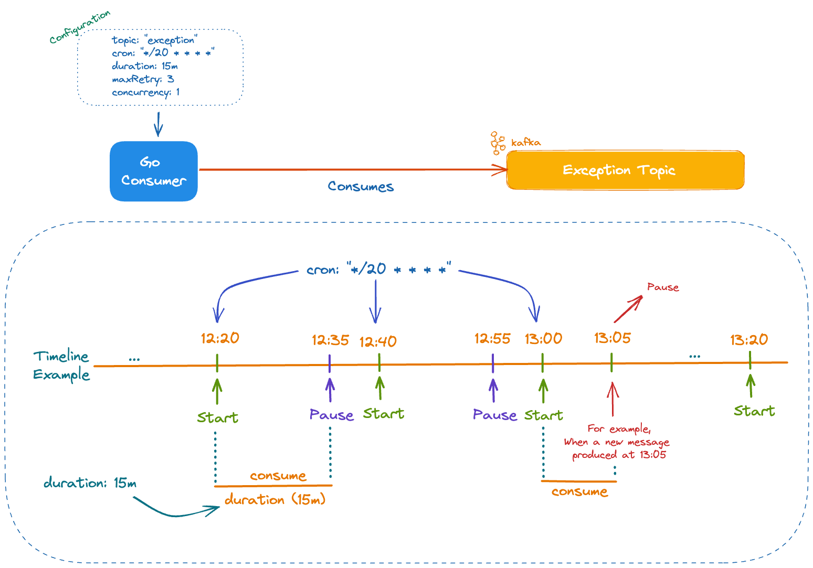

# Kafka C[r]onsumer [](https://pkg.go.dev/github.com/Trendyol/kafka-cronsumer) [](https://goreportcard.com/report/github.com/Trendyol/kafka-cronsumer)

<div style="text-align:center"></div>

## Description

Kafka Cronsumer is mainly used for retry/exception strategy management.
It works based on cron expression and consumes messages in a timely manner
with the power of auto pause and concurrency. 

[For details check our blog post](https://medium.com/trendyol-tech/kafka-exception-c-r-onsumer-37c459e4849d)

#### If you need a whole consumer lifecycle with exception management, check [Kafka Konsumer](https://github.com/Trendyol/kafka-konsumer)

## How Kafka Cronsumer Works



## When to use it?

- Iteration-based back-off strategies are applicable
- Messages could be processed in an eventually consistent state
- Max retry exceeded messages could be ignored and send to dead letter topic
- To increase consumer resiliency
- To increase consumer performance with concurrency

## When to avoid?

- Messages should be processed in order
- Messages should be certainly processed (we discard messages if max retry is exceeded)
- Messages should be committed (we use auto-commit interval for increasing performance)
- Messages with TTL (Time to Live)

## Guide

### Installation

```sh
go get github.com/Trendyol/kafka-cronsumer@latest
```

### Examples

You can find a number of ready-to-run examples at [this directory](examples).

After running `docker-compose up` command, you can run any application you want. 
Don't forget its cron based :)

#### Single Consumer

```go
func main() {
  // ...
  var consumeFn kafka.ConsumeFn = func (message kafka.Message) error {
    fmt.Printf("consumer > Message received: %s\n", string(message.Value))
    return nil
  }

  c := cronsumer.New(kafkaConfig, consumeFn)
  c.Run()
}
```

#### Single Consumer With Dead Letter

```go
func main() {
  // ...
  var consumeFn kafka.ConsumeFn = func (message kafka.Message) error {
    fmt.Printf("consumer > Message received: %s\n", string(message.Value))
    return errors.New("error occurred")
  }

  c := cronsumer.New(kafkaConfig, consumeFn)
  c.Run()
}
```

#### Multiple Consumers

```go
func main() {
  // ...
  var firstConsumerFn kafka.ConsumeFn = func (message kafka.Message) error {
    fmt.Printf("First consumer > Message received: %s\n", string(message.Value))
    return nil
  }
  first := cronsumer.New(firstCfg, firstConsumerFn)
  first.Start()

  var secondConsumerFn kafka.ConsumeFn = func (message kafka.Message) error {
    fmt.Printf("Second consumer > Message received: %s\n", string(message.Value))
    return nil
  }
  second := cronsumer.New(secondCfg, secondConsumerFn)
  second.Start()
  // ...    
}
```

#### Single Consumer With Metric collector

```go
func main() {
  // ...
  var consumeFn kafka.ConsumeFn = func(message kafka.Message) error {
    return errors.New("err occurred")
  }
  
  c := cronsumer.New(config, consumeFn)
  StartAPI(*config, c.GetMetricCollectors()...)
  c.Start()
  // ...    
}

func StartAPI(cfg kafka.Config, metricCollectors ...prometheus.Collector) {
  // ...
  f := fiber.New(
    fiber.Config{},
  )
  
  metricMiddleware, err := NewMetricMiddleware(cfg, f, metricCollectors...)
  
  f.Use(metricMiddleware)
  // ...
}
```

## Configurations

| config                       | description                                                                                        | default  | example                  |
|------------------------------|----------------------------------------------------------------------------------------------------|----------|--------------------------|
| `logLevel`                   | Describes log level, valid options are `debug`, `info`, `warn`, and `error`                        | info     |                          |
| `consumer.clientId`          | [see doc](https://pkg.go.dev/github.com/segmentio/kafka-go@v0.4.39#Dialer)                         |          |                          |
| `consumer.cron`              | Cron expression when exception consumer starts to work at                                          |          | */1 * * * *              |
| `consumer.backOffStrategy`   | Define consumer backoff strategy for retry topics                                                  | fixed    | exponential, linear      |
| `consumer.duration`          | Work duration exception consumer actively consuming messages                                       |          | 20s, 15m, 1h             |
| `consumer.topic`             | Exception topic names                                                                              |          | exception-topic          |
| `consumer.groupId`           | Exception consumer group id                                                                        |          | exception-consumer-group |
| `consumer.maxRetry`          | Maximum retry value for attempting to retry a message                                              | 3        |                          |
| `consumer.concurrency`       | Number of goroutines used at listeners                                                             | 1        |                          |
| `consumer.minBytes`          | [see doc](https://pkg.go.dev/github.com/segmentio/kafka-go@v0.4.39#ReaderConfig.MinBytes)          | 1        |                          |
| `consumer.maxBytes`          | [see doc](https://pkg.go.dev/github.com/segmentio/kafka-go@v0.4.39#ReaderConfig.MaxBytes)          | 1 MB     |                          |
| `consumer.maxWait`           | [see doc](https://pkg.go.dev/github.com/segmentio/kafka-go@v0.4.39#ReaderConfig.MaxWait)           | 10s      |                          |
| `consumer.commitInterval`    | [see doc](https://pkg.go.dev/github.com/segmentio/kafka-go@v0.4.39#ReaderConfig.CommitInterval)    | 1s       |                          |
| `consumer.heartbeatInterval` | [see doc](https://pkg.go.dev/github.com/segmentio/kafka-go@v0.4.39#ReaderConfig.HeartbeatInterval) | 3s       |                          |
| `consumer.sessionTimeout`    | [see doc](https://pkg.go.dev/github.com/segmentio/kafka-go@v0.4.39#ReaderConfig.SessionTimeout)    | 30s      |                          |
| `consumer.rebalanceTimeout`  | [see doc](https://pkg.go.dev/github.com/segmentio/kafka-go@v0.4.39#ReaderConfig.RebalanceTimeout)  | 30s      |                          |
| `consumer.startOffset`       | [see doc](https://pkg.go.dev/github.com/segmentio/kafka-go@v0.4.39#ReaderConfig.StartOffset)       | earliest |                          |
| `consumer.retentionTime`     | [see doc](https://pkg.go.dev/github.com/segmentio/kafka-go@v0.4.39#ReaderConfig.RetentionTime)     | 24h      |                          |
| `consumer.HeaderFilterFn`    | Function to filter messages based on headers                                                       | nil      |                          |
| `producer.clientId`          | [see doc](https://pkg.go.dev/github.com/segmentio/kafka-go@v0.4.39#Transport)                      |          |                          |
| `producer.batchSize`         | [see doc](https://pkg.go.dev/github.com/segmentio/kafka-go@v0.4.39#Writer.BatchSize)               | 100      |                          |
| `producer.batchTimeout`      | [see doc](https://pkg.go.dev/github.com/segmentio/kafka-go@v0.4.39#Writer.BatchTimeout)            | 1s       |                          |
| `sasl.enabled`               | It enables sasl authentication mechanism                                                           | false    |                          |
| `sasl.authType`              | Currently we only support `SCRAM`                                                                  | ""       |                          |
| `sasl.username`              | SCRAM username                                                                                     | ""       |                          |
| `sasl.password`              | SCRAM password                                                                                     | ""       |                          |
| `sasl.rootCAPath`            | [see doc](https://pkg.go.dev/crypto/tls#Config.RootCAs)                                            | ""       |                          |
| `sasl.intermediateCAPath`    |                                                                                                    | ""       |                          |
| `sasl.rack`                  | [see doc](https://pkg.go.dev/github.com/segmentio/kafka-go@v0.4.39#RackAffinityGroupBalancer)      | ""       |                          |

### Exposed Metrics

| Metric Name                              | Description                          | Value Type |
|------------------------------------------|--------------------------------------|------------|
| kafka_cronsumer_retried_messages_total   | Total number of retried messages.    | Counter    |
| kafka_cronsumer_discarded_messages_total | Total number of discarded  messages. | Counter    |


## Contribute

**Use issues for everything**

- For a small change, just send a PR.
- For bigger changes open an issue for discussion before sending a PR.
- PR should have:
    - Test case
    - Documentation
    - Example (If it makes sense)
- You can also contribute by:
    - Reporting issues
    - Suggesting new features or enhancements
    - Improve/fix documentation

Please adhere to this project's `code of conduct`.

## Maintainers

- [@Abdulsametileri](https://github.com/Abdulsametileri)
- [@emreodabas](https://github.com/emreodabas)

## Code of Conduct

[Contributor Code of Conduct](CODE-OF-CONDUCT.md). By participating in this project you agree to abide by its terms.

## Libraries Used For This Project

- [segmentio/kafka-go](https://github.com/segmentio/kafka-go)
- [robfig/cron](https://github.com/robfig/cron)
- [uber-go/zap](https://github.com/uber-go/zap)

## Additional References

- [Kcat](https://github.com/edenhill/kcat)
- [jq](https://stedolan.github.io/jq/)
- [golangci-lint](https://github.com/golangci/golangci-lint)
- [Kafka Console Producer](https://kafka.apache.org/quickstart)
