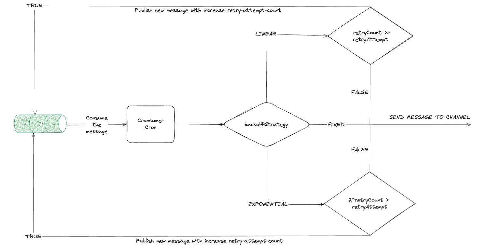

## How BackOff Strategy Works

**The users can configure consumer easily like this;**

`...

          cron: "*/1 * * * *"
          backOffStrategy: "exponential"
          duration: 1m
          concurrency: 1
`

# Backoff Strategies Descriptions 

1.  **Linear Backoff:** It involves linearly increasing the time between each retry attempt. (1, 2, 3, 4..)
2. **Exponential Backoff:** It involves exponentially increasing the time between each retry attempt. (1, 2, 4, 8..)
3. **Fixed Backoff:** In this strategy, the delay between retry attempts remains constant. This strategy is simple to implement but may not be suitable for all scenarios.

